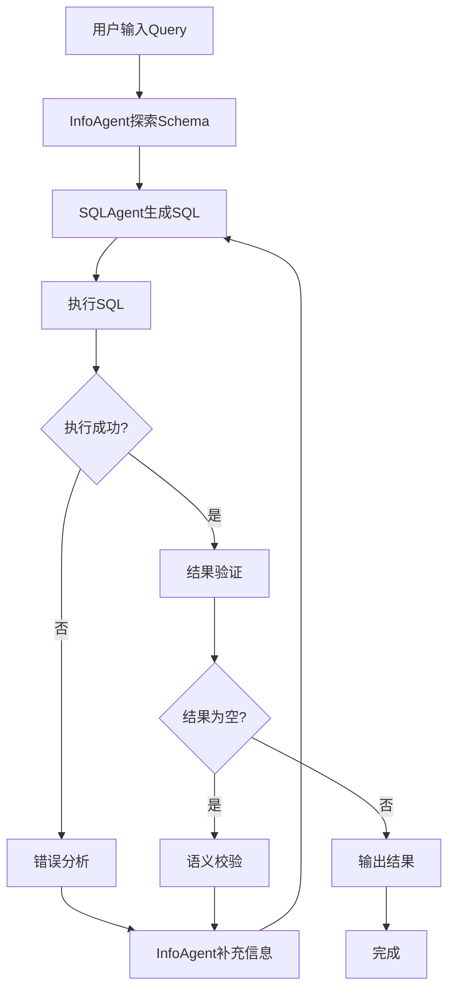

基于 LangGraph 构建的智能 SQL 生成系统，通过 InfoAgent 和 SQLAgent 的协作，实现自然语言到 SQL 的自动转换，并支持错误自我修正。

## 系统架构

### 核心组件

1. **InfoAgent** - 数据库 Schema 信息探索 Agent

   - 表结构探索（基于图结构的信息收集）
   - 信息汇总（将图结构转换为高信息熵的文本）
   - 错误驱动的结构补全

2. **SQLAgent** - SQL 生成 Agent

   - SQL 生成（通过传递来的数据库信息和用户 query 生成 sql）
   - 自检机制（调用接口验证 sql 的正确性，返回错误信息给 InfoAgent）

3. **LangGraph 系统** - 工作流编排
   - 状态管理
   - 错误处理和重试机制
   - 人机交互循环支持

### 工作流程



## 安装与配置

### 环境要求

- Python 3.8+
- LangGraph 0.2+
- Neo4j（图数据库）
- Snowflake 连接权限

### 依赖安装

```bash
pip install langgraph langchain-core langchain-anthropic
pip install neo4j snowflake-connector-python
pip install pydantic typing-extensions
```

### 环境变量配置

创建 `.env` 文件并配置：

```env
# LLM配置
LLM_MODEL=gpt-4o-mini
OPENAI_API_KEY=your_openai_api_key

# Snowflake配置
SNOWFLAKE_USER=your_username
SNOWFLAKE_PASSWORD=your_password
SNOWFLAKE_ACCOUNT=your_account

# Neo4j配置
NEO4J_URI=neo4j://localhost:7687
NEO4J_USER=neo4j
NEO4J_PASSWORD=your_password

# 日志配置
LANGSMITH_API_KEY=your_langsmith_key
LANGCHAIN_TRACING_V2=true
LANGCHAIN_PROJECT=SQL_Generation_System
```

## 使用方法

### 基本使用

```python
from method.graph_system import SQLGenerationSystem

# 初始化系统
system = SQLGenerationSystem(enable_logging=True)

# 运行查询
result = system.run(
    user_query="What is the total market value of USDC tokens in 2023?",
    database_id="CRYPTO",
    additional_info=""
)

# 检查结果
if result['success']:
    print(f"生成的SQL: {result['final_sql']}")
    print(f"查询结果: {len(result['final_result'])} 行数据")
else:
    print(f"执行失败: {result.get('error_info')}")
```

### 命令行使用

```bash
# 运行预定义测试查询（默认模式）
cd method
python main.py

# 运行自定义查询
python main.py --query "What is the total market value of USDC tokens in 2023?" --database CRYPTO

# 使用简化参数
python main.py -q "SELECT * FROM table" -d CRYPTO

# 添加额外信息
python main.py -q "查询语句" -d CRYPTO --additional-info "额外信息"

# 不保存结果到CSV文件
python main.py -q "查询语句" --no-csv
```

### 命令行参数说明

- `--query, -q`: 用户查询语句（可选，不提供则运行预定义测试）
- `--database, -d`: 数据库 ID（默认：CRYPTO）
- `--additional-info, -a`: 额外信息（可选）
- `--no-csv`: 不保存结果到 CSV 文件

### 测试系统

```bash
# 快速测试
python test_system.py --quick

# 完整测试套件
python test_system.py --full
```

## API 接口

### SQLGenerationSystem

主要系统类，协调 InfoAgent 和 SQLAgent 的工作。

```python
class SQLGenerationSystem:
    def __init__(self, enable_logging: bool = True)
    def run(self, user_query: str, database_id: str, additional_info: str = "") -> Dict[str, Any]
```

#### 返回结果格式

```json
{
    "success": true,
    "final_sql": "SELECT ...",
    "final_result": [...],
    "iterations": 3,
    "schema_discovered": {...},
    "execution_history": [...],
    "error_info": null
}
```

### InfoAgent

数据库信息探索 Agent。

```python
class InfoAgent:
    def get_all_tables(self, database_id: str) -> Dict[str, Any]
    def get_table_fields(self, table_name: str, database_id: str) -> Dict[str, Any]
    def find_tables_by_field(self, field_name: str, database_id: str) -> List[Dict[str, Any]]
    def suggest_similar_fields(self, field_name: str, database_id: str) -> List[Dict[str, Any]]
    def summarize_related_schema(self, keywords: List[str], database_id: str) -> str
```

### SQLAgent

SQL 生成 Agent。

```python
class SQLAgent:
    def parse_user_query(self, user_query: str) -> Dict[str, Any]
    def generate_sql(self, state: SystemState, schema_info: Dict[str, Any]) -> str
    def execute_sql(self, sql_query: str, database_id: str) -> SQLExecutionResult
    def validate_sql_quality(self, sql_query: str, user_query: str) -> Dict[str, Any]
```

## 配置选项

### 系统参数

```python
# 在graph_system.py中可调整的参数
initial_state = {
    "max_iterations": 5,  # 最大迭代次数
    "error_threshold": 3,  # 错误阈值
}
```

### InfoAgent 配置

```python
# Schema探索配置
similarity_threshold = 0.6  # 相似度阈值
max_suggestions = 10       # 最大建议数量
```

### SQLAgent 配置

```python
# SQL质量阈值
quality_threshold = 0.7    # 质量分数阈值
max_retries = 3           # 最大重试次数
```

## 错误处理

系统包含完善的错误处理机制：

### 错误类型

- `NETWORK_ERROR`: 网络连接错误
- `DATABASE_ERROR`: 数据库错误
- `SQL_SYNTAX_ERROR`: SQL 语法错误
- `SCHEMA_ERROR`: Schema 相关错误
- `LLM_ERROR`: LLM 调用错误
- `VALIDATION_ERROR`: 验证错误
- `TIMEOUT_ERROR`: 超时错误

### 重试策略

- 网络错误：指数退避重试
- 数据库错误：短延迟重试
- Schema 错误：立即重试
- 语法错误：不重试（需要重新生成）

### 错误恢复

1. **表不存在** → InfoAgent 查找相似表名
2. **字段不存在** → InfoAgent 查找相似字段
3. **语法错误** → SQLAgent 重新生成
4. **结果为空** → 分析查询条件并调整

## 性能监控

系统内置性能监控功能：

```python
from method.error_handler import global_performance_monitor

# 获取性能报告
report = global_performance_monitor.get_performance_report()
print(report)
```

## 日志配置

系统支持详细的日志记录：

```python
import logging

# 配置日志级别
logging.basicConfig(
    level=logging.INFO,
    format='%(asctime)s - %(name)s - %(levelname)s - %(message)s'
)
```

## 扩展开发

### 添加新的工具

```python
# 在InfoAgent中添加新方法
def get_table_relationships(self, database_id: str) -> List[Dict[str, Any]]:
    # 实现表关系查询
    pass
```

### 自定义 SQL 生成策略

```python
# 在SQLAgent中扩展生成策略
def generate_complex_sql(self, query_analysis: Dict[str, Any]) -> str:
    # 实现复杂SQL生成逻辑
    pass
```

### 添加新的数据库支持

```python
# 创建新的数据库连接器
class PostgreSQLConnector:
    def execute_query(self, sql: str) -> List[Dict[str, Any]]:
        # 实现PostgreSQL查询
        pass
```

## 故障排除

### 常见问题

1. **连接失败**

   - 检查数据库连接配置
   - 验证网络连接
   - 确认凭据正确

2. **LLM 调用失败**

   - 检查 API 密钥
   - 验证模型可用性
   - 检查请求频率限制

3. **Schema 探索失败**

   - 检查图数据库连接
   - 验证权限设置
   - 确认数据库存在

4. **SQL 执行错误**
   - 查看错误日志
   - 检查 SQL 语法
   - 验证表和字段存在

### 调试模式

```python
# 启用详细日志
system = SQLGenerationSystem(enable_logging=True)

# 检查系统健康状态
from method.error_handler import global_health_checker
health = global_health_checker.perform_health_check()
print(health)
```

## 最佳实践

1. **查询优化**

   - 使用具体的字段名而非 SELECT \*
   - 添加适当的 WHERE 条件
   - 使用 LIMIT 限制结果集大小

2. **错误处理**

   - 捕获和记录所有异常
   - 提供有意义的错误消息
   - 实现适当的重试机制

3. **性能监控**

   - 定期检查系统健康状态
   - 监控查询执行时间
   - 分析错误模式

4. **安全考虑**
   - 验证用户输入
   - 使用参数化查询
   - 限制数据库权限
