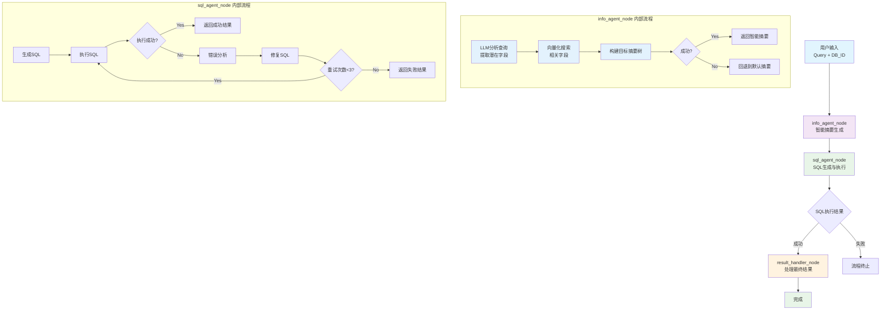

基于 LangGraph 构建的智能 SQL 生成系统，采用函数式编程架构，通过函数式 InfoAgent 和 SQLAgent 的协作，实现自然语言到 SQL 的自动转换，并支持错误自我修正。

**最新更新**：系统已完成模块化重构，将 Agent 系统构建逻辑独立到 `BuildAgentSystem.py` 模块，使代码结构更加清晰，职责分离更明确。

## 系统架构

### 核心组件

1. **通信模块 (Communicate.py)** - 状态、消息和数据结构定义

   - SystemState：LangGraph 图系统状态定义
   - DatabaseSummary：数据库摘要树结构
   - SQLExecutionResult：SQL 执行结果
   - SqlErrorContext：SQL 错误上下文
   - SqlQueryResponse：SQL 查询响应模型

2. **Agent 系统构建模块 (BuildAgentSystem.py)** - Agent 系统构建与编排

   - info_agent_node：InfoAgent 节点函数（支持智能摘要生成）
   - sql_agent_node：SqlAgent 节点函数
   - result_handler_node：结果处理节点
   - route_completion：路由函数
   - build_agent_system：构建完整的 Agent 系统图

3. **主程序模块 (main.py)** - 输入输出处理与并发控制

   - 命令行接口和参数解析
   - 批量处理和并发控制
   - 结果保存和输出格式化
   - 日志配置和系统入口

4. **InfoAgent 模块 (InfoAgent.py)** - 数据库 Schema 信息获取

   - get_db_summary：获取默认数据库摘要树
   - get_intelligent_db_summary：基于用户查询生成智能摘要树
   - search_related_fields：向量化搜索相关字段
   - extract_potential_fields_from_query：使用 LLM 分析查询提取字段名

5. **SQLAgent 模块 (SqlAgent.py)** - SQL 生成与错误修复

   - run_sql_agent：处理完整查询流程（包含错误分析和修复功能）
   - generate_sql：SQL 生成
   - analyze_sql_error：SQL 错误分析
   - fix_sql_with_conversation：多轮对话修复 SQL
   - sql_execution_tool：LangGraph Tool 形式的 SQL 执行器

6. **提示模板模块 (prompts.py)** - LLM 提示模板集合
   - SQL_AGENT_PROMPT：SQL 生成提示模板
   - ERROR_ANALYSIS_PROMPT：错误分析提示模板
   - SQL_FIX_PROMPT：SQL 修复提示模板

### 工作流程



系统工作流程说明：

1. **info_agent_node**：
   - 使用 LLM 分析用户查询，提取潜在字段名
   - 使用向量化搜索找到相关字段
   - 构建智能摘要树，失败时回退到默认摘要
2. **sql_agent_node**：包含完整的 SQL 生成、执行、错误分析和修复循环
   - 生成初始 SQL
   - 执行 SQL 并捕获结果
   - 如果失败，进行错误分析和 SQL 修复
   - 最多重试 3 次
3. **result_handler_node**：处理最终结果并完成流程

## 使用方法

### 基本使用

```python
from method.main import run

# 方式1：直接使用主函数（推荐）
result = run(
    query="What is the total market value of USDC tokens in 2023?",
    database_id="CRYPTO",
    additional_info="",
    save_to_csv=True
)

# 方式2：使用命令行
# python main.py -q "What is the total market value of USDC tokens in 2023?" -d CRYPTO

# 方式3：使用Agent系统构建模块
from method.BuildAgentSystem import build_agent_system
from method.Communicate import SystemState

# 构建Agent系统图
graph = build_agent_system()

# 初始状态
initial_state: SystemState = {
    "user_query": "What is the total market value of USDC tokens in 2023?",
    "database_id": "CRYPTO",
    "schema_info": {},
    "generated_sql": "",
    "execution_result": {},
    "step": "start",
    "iteration": 0,
    "final_sql": "",
    "final_result": [],
    "error_message": "",
    "is_completed": False
}

# 运行图
config = {"configurable": {"thread_id": "sql_session"}}
result = graph.invoke(initial_state, config)

# 方式4：分别使用各个函数
from method.InfoAgent import get_intelligent_db_summary, get_db_summary
from method.SqlAgent import run_sql_agent

# 使用智能摘要
schema_info = get_intelligent_db_summary("CRYPTO", "What is the total market value of USDC tokens in 2023?")
# 或使用默认摘要
# schema_info = get_db_summary("CRYPTO")

result = run_sql_agent("What is the total market value of USDC tokens in 2023?", schema_info, "CRYPTO")
```

### 命令行使用

```bash
# 运行预定义测试查询（默认模式）
cd method
python main.py

# 运行自定义查询
python main.py --query "What is the total market value of USDC tokens in 2023?" --database CRYPTO

# 使用简化参数
python main.py -q "SELECT * FROM table" -d CRYPTO

# 添加额外信息
python main.py -q "查询语句" -d CRYPTO --additional-info "额外信息"

# 不保存结果到CSV文件
python main.py -q "查询语句" --no-csv
```

### 命令行参数说明

- `--query, -q`: 用户查询语句（可选，不提供则运行预定义测试）
- `--database, -d`: 数据库 ID（默认：CRYPTO）
- `--additional-info, -a`: 额外信息（可选）
- `--no-csv`: 不保存结果到 CSV 文件

## 系统状态定义

```python
# SystemState - LangGraph 图系统状态
class SystemState(TypedDict):
    user_query: str              # 用户查询
    database_id: str             # 数据库ID
    messages: Annotated[List[BaseMessage], add_messages]  # LangGraph消息管理
    schema_info: DatabaseSummary # Schema信息
    generated_sql: str           # 生成的SQL
    execution_result: Dict[str, Any]  # 执行结果
    step: str                    # 当前步骤
    iteration: int               # 当前迭代次数
    retry_count: int             # 重试次数
    max_retries: int             # 最大重试次数
    final_sql: str              # 最终SQL
    final_result: List[Dict[str, Any]]  # 最终结果
    error_message: str          # 错误信息
    is_completed: bool          # 是否完成

# DatabaseSummary - 数据库摘要树结构
class DatabaseSummary(TypedDict):
    database: str
    schemas: List[SchemaSummary]
    _search_metadata: Optional[Dict[str, Any]]  # 智能摘要搜索元信息

class SchemaSummary(TypedDict):
    schema: str
    tables: List[TableSummary]

class TableSummary(TypedDict):
    table: str
    fields: List[Union[str, Dict[str, str]]]  # 支持字段详细信息
```

## 核心函数接口

### BuildAgentSystem 函数

```python
def build_agent_system() -> StateGraph:
    """构建Agent系统图"""

def info_agent_node(state: SystemState) -> Dict[str, Any]:
    """InfoAgent节点函数"""

def sql_agent_node(state: SystemState) -> Union[Dict[str, Any], Send]:
    """SqlAgent节点函数"""

def result_handler_node(state: SystemState) -> Dict[str, Any]:
    """结果处理节点函数"""

def route_completion(state: SystemState) -> str:
    """路由到完成状态"""
```

### InfoAgent 函数

```python
def get_db_summary(database_id: str) -> Dict[str, Any]:
    """获取默认数据库摘要树"""

def get_intelligent_db_summary(database_id: str, user_query: str, top_k: int = 10) -> Dict[str, Any]:
    """基于用户查询生成智能摘要树"""

def search_related_fields(query: List[str], database_id: str, top_k: int = 3) -> List[Dict[str, Any]]:
    """向量化搜索相关字段"""

def extract_potential_fields_from_query(user_query: str) -> List[str]:
    """使用LLM分析查询提取字段名"""
```

### SqlAgent 函数

```python
def run_sql_agent(user_query: str, schema_info: DatabaseSummary, database_id: str) -> Dict[str, Any]:
    """处理完整查询流程"""

def generate_sql(user_query: str, schema_info: DatabaseSummary, database_id: str) -> str:
    """生成SQL语句"""

def analyze_sql_error(user_query: str, generated_sql: str, error_message: str, database_id: str, schema_info: DatabaseSummary) -> Dict[str, Any]:
    """分析SQL错误"""

def fix_sql_with_conversation(context: SqlErrorContext, error_analysis: Dict[str, Any], conversation_history: List[str]) -> Dict[str, Any]:
    """修复SQL"""

@tool
def sql_execution_tool(sql_query: str, database_id: str) -> Dict[str, Any]:
    """执行SQL查询的LangGraph Tool"""
```

## 返回结果格式

```python
# 系统最终输出格式
{
    "success": bool,
    "final_sql": str,
    "final_result": List[Dict[str, Any]],
    "iterations": int,
    "execution_time": float,
    "csv_file": Optional[str],
    "error_message": Optional[str],
    "retry_count": int
}

# 智能摘要搜索元信息
{
    "user_query": str,
    "extracted_fields": List[str],
    "found_fields_count": int,
    "used_field_ids": List[str]
}
```

## 系统特性

### 智能摘要生成

- **LLM 字段提取**: 使用 LLM 智能分析用户查询，提取潜在字段名
- **向量化搜索**: 使用预训练向量索引快速找到相关字段
- **自动回退**: 智能摘要生成失败时自动回退到默认摘要
- **搜索元信息**: 提供完整的搜索和匹配信息用于调试和分析

### LangGraph Tool 集成

- **模块化 SQL 执行**: 使用 `sql_execution_tool` 封装 SQL 执行逻辑
- **标准接口**: 遵循 LangGraph Tool 规范
- **内置错误处理**: Tool 内置完整的错误处理机制

### 智能错误分析与修复

- **LLM 错误分析**: 使用 LLM 智能分析 SQL 错误类型和原因
- **自动修复**: 支持语法错误和逻辑错误的自动修复
- **重试机制**: 最大重试次数为 3 次，避免无限循环

### 系统架构特点

- **模块化设计**: Agent 系统构建逻辑独立到 BuildAgentSystem.py 模块，主程序专注于输入输出处理
- **纯函数式设计**: 所有核心功能都封装为纯函数
- **LangGraph 状态管理**: 使用 LangGraph 内置消息管理机制
- **简化流程**: 三节点设计，流程清晰简洁
- **职责分离**: main.py 负责并发控制和 I/O，BuildAgentSystem.py 负责系统图构建

## 最新重构说明

### 模块化重构 (v2.0)

为了提高代码的可维护性和模块化程度，系统进行了重要的架构重构：

#### 重构内容

1. **新增 BuildAgentSystem.py 模块**：

   - 将 Agent 节点函数从 main.py 移动到专门的构建模块
   - 包含 `info_agent_node`、`sql_agent_node`、`result_handler_node` 等核心节点
   - 新增 `build_agent_system()` 函数统一构建系统图

2. **main.py 重构**：

   - 移除 Agent 系统构建相关代码，减少约 150 行代码
   - 专注于输入输出处理、批量处理和并发控制
   - 保持原有的命令行接口不变

3. **模块职责分离**：
   - **BuildAgentSystem.py**：负责 Agent 系统图构建和节点定义
   - **main.py**：负责 I/O 处理、并发控制和系统入口
   - **InfoAgent.py**：负责数据库信息获取和智能摘要
   - **SqlAgent.py**：负责 SQL 生成和错误修复

#### 重构优势

- **更好的模块化**：各模块职责单一，便于维护和扩展
- **代码复用性**：BuildAgentSystem 模块可在其他项目中复用
- **更清晰的架构**：系统层次更加分明，依赖关系更清晰
- **向后兼容**：所有原有接口保持不变，用户无需修改调用方式

#### 使用方式

```python
# 原有方式仍然有效
from method.main import run
result = run("查询语句", "数据库ID")

# 新增：直接使用构建模块
from method.BuildAgentSystem import build_agent_system
graph = build_agent_system()
```

## 最新重构说明

### 模块化重构 (v2.0)

为了提高代码的可维护性和模块化程度，系统进行了重要的架构重构：

#### 重构内容

1. **新增 BuildAgentSystem.py 模块**：

   - 将 Agent 节点函数从 main.py 移动到专门的构建模块
   - 包含 `info_agent_node`、`sql_agent_node`、`result_handler_node` 等核心节点
   - 新增 `build_agent_system()` 函数统一构建系统图

2. **main.py 重构**：

   - 移除 Agent 系统构建相关代码，减少约 150 行代码
   - 专注于输入输出处理、批量处理和并发控制
   - 保持原有的命令行接口不变

3. **模块职责分离**：
   - **BuildAgentSystem.py**：负责 Agent 系统图构建和节点定义
   - **main.py**：负责 I/O 处理、并发控制和系统入口
   - **InfoAgent.py**：负责数据库信息获取和智能摘要
   - **SqlAgent.py**：负责 SQL 生成和错误修复

#### 重构优势

- **更好的模块化**：各模块职责单一，便于维护和扩展
- **代码复用性**：BuildAgentSystem 模块可在其他项目中复用
- **更清晰的架构**：系统层次更加分明，依赖关系更清晰
- **向后兼容**：所有原有接口保持不变，用户无需修改调用方式

#### 使用方式

```python
# 原有方式仍然有效
from method.main import run
result = run("查询语句", "数据库ID")

# 新增：直接使用构建模块
from method.BuildAgentSystem import build_agent_system
graph = build_agent_system()
```

## 配置说明

### 系统参数

- **最大重试次数**: 3 次（在 SqlAgent 中配置）
- **执行超时**: 5 分钟（在 main.py 中配置）
- **LangGraph 配置**: `{"configurable": {"thread_id": "sql_session"}}`
- **向量搜索参数**:
  - 默认返回字段数: 10
  - 向量维度: 1536 (text-embedding-3-small)

### 日志配置

系统使用 Python 标准日志模块，支持文件和控制台输出：

```python
import logging

logging.basicConfig(
    level=logging.INFO,
    format='%(asctime)s - %(name)s - %(levelname)s - %(message)s',
    handlers=[
        logging.FileHandler('sql_generation.log'),
        logging.StreamHandler()
    ]
)
```
