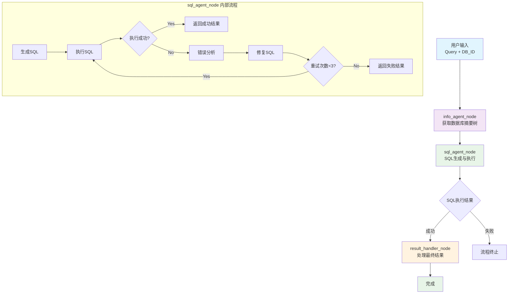

基于 LangGraph 构建的智能 SQL 生成系统，采用函数式编程架构，通过函数式 InfoAgent 和 SQLAgent 的协作，实现自然语言到 SQL 的自动转换，并支持错误自我修正。

## 系统架构

### 核心组件

1. **通信模块 (Communicate.py)** - 状态、消息和数据结构定义

   - SystemState：LangGraph 图系统状态定义
   - DatabaseSummary：数据库摘要树结构
   - SQLExecutionResult：SQL 执行结果
   - SqlErrorContext：SQL 错误上下文
   - SqlQueryResponse：SQL 查询响应模型

2. **主程序模块 (main.py)** - 核心功能实现

   - info_agent_node：InfoAgent 节点函数
   - sql_agent_node：SqlAgent 节点函数
   - result_handler_node：结果处理节点
   - 工作流程编排
   - 状态管理
   - 命令行接口

3. **InfoAgent 模块 (InfoAgent.py)** - 数据库 Schema 信息获取

   - get_db_summary：获取数据库摘要树（通过单个 Cypher 查询）

4. **SQLAgent 模块 (SqlAgent.py)** - SQL 生成与错误修复

   - run_sql_agent：处理完整查询流程（包含错误分析和修复功能）
   - generate_sql：SQL 生成
   - analyze_sql_error：SQL 错误分析
   - fix_sql_with_conversation：多轮对话修复 SQL
   - sql_execution_tool：LangGraph Tool 形式的 SQL 执行器

5. **提示模板模块 (prompts.py)** - LLM 提示模板集合
   - SQL_AGENT_PROMPT：SQL 生成提示模板
   - ERROR_ANALYSIS_PROMPT：错误分析提示模板
   - SQL_FIX_PROMPT：SQL 修复提示模板

### 工作流程



系统工作流程说明：

1. **info_agent_node**：通过单个 Cypher 查询获取数据库的结构化摘要树
2. **sql_agent_node**：包含完整的 SQL 生成、执行、错误分析和修复循环
   - 生成初始 SQL
   - 执行 SQL 并捕获结果
   - 如果失败，进行错误分析和 SQL 修复
   - 最多重试 3 次
3. **result_handler_node**：处理最终结果并完成流程

## 使用方法

### 基本使用

```python
from method.main import run

# 直接使用主函数
result = run(
    query="What is the total market value of USDC tokens in 2023?",
    database_id="CRYPTO",
    additional_info="",
    save_to_csv=True
)

# 方式2：使用命令行
# python main.py -q "What is the total market value of USDC tokens in 2023?" -d CRYPTO

# 方式3：分别使用各个函数
from method.InfoAgent import get_db_summary
from method.SqlAgent import run_sql_agent

schema_info = get_db_summary("CRYPTO")
result = run_sql_agent("What is the total market value of USDC tokens in 2023?", schema_info, "CRYPTO")
```

### 命令行使用

```bash
# 运行预定义测试查询（默认模式）
cd method
python main.py

# 运行自定义查询
python main.py --query "What is the total market value of USDC tokens in 2023?" --database CRYPTO

# 使用简化参数
python main.py -q "SELECT * FROM table" -d CRYPTO

# 添加额外信息
python main.py -q "查询语句" -d CRYPTO --additional-info "额外信息"

# 不保存结果到CSV文件
python main.py -q "查询语句" --no-csv
```

### 命令行参数说明

- `--query, -q`: 用户查询语句（可选，不提供则运行预定义测试）
- `--database, -d`: 数据库 ID（默认：CRYPTO）
- `--additional-info, -a`: 额外信息（可选）
- `--no-csv`: 不保存结果到 CSV 文件

## 系统状态定义

```python
# SystemState - LangGraph 图系统状态
class SystemState(TypedDict):
    user_query: str              # 用户查询
    database_id: str             # 数据库ID
    messages: Annotated[List[BaseMessage], add_messages]  # LangGraph消息管理
    schema_info: DatabaseSummary # Schema信息
    generated_sql: str           # 生成的SQL
    execution_result: Dict[str, Any]  # 执行结果
    step: str                    # 当前步骤
    iteration: int               # 当前迭代次数
    retry_count: int             # 重试次数
    max_retries: int             # 最大重试次数
    final_sql: str              # 最终SQL
    final_result: List[Dict[str, Any]]  # 最终结果
    error_message: str          # 错误信息
    is_completed: bool          # 是否完成

# DatabaseSummary - 数据库摘要树结构
class DatabaseSummary(TypedDict):
    database: str
    schemas: List[SchemaSummary]

class SchemaSummary(TypedDict):
    schema: str
    tables: List[TableSummary]

class TableSummary(TypedDict):
    table: str
    fields: List[str]
```

## 核心函数接口

### InfoAgent 函数

```python
def get_db_summary(database_id: str) -> Dict[str, Any]:
    """获取数据库摘要树"""
```

### SqlAgent 函数

```python
def run_sql_agent(user_query: str, schema_info: DatabaseSummary, database_id: str) -> Dict[str, Any]:
    """处理完整查询流程"""

def generate_sql(user_query: str, schema_info: DatabaseSummary, database_id: str) -> str:
    """生成SQL语句"""

def analyze_sql_error(user_query: str, generated_sql: str, error_message: str, database_id: str, schema_info: DatabaseSummary) -> Dict[str, Any]:
    """分析SQL错误"""

def fix_sql_with_conversation(context: SqlErrorContext, error_analysis: Dict[str, Any], conversation_history: List[str]) -> Dict[str, Any]:
    """修复SQL"""

@tool
def sql_execution_tool(sql_query: str, database_id: str) -> Dict[str, Any]:
    """执行SQL查询的LangGraph Tool"""
```

## 返回结果格式

```python
# 系统最终输出格式
{
    "success": bool,
    "final_sql": str,
    "final_result": List[Dict[str, Any]],
    "iterations": int,
    "execution_time": float,
    "csv_file": Optional[str],
    "error_message": Optional[str],
    "retry_count": int
}
```

## 系统特性

### LangGraph Tool 集成

- **模块化 SQL 执行**: 使用 `sql_execution_tool` 封装 SQL 执行逻辑
- **标准接口**: 遵循 LangGraph Tool 规范
- **内置错误处理**: Tool 内置完整的错误处理机制

### 智能错误分析与修复

- **LLM 错误分析**: 使用 LLM 智能分析 SQL 错误类型和原因
- **自动修复**: 支持语法错误和逻辑错误的自动修复
- **重试机制**: 最大重试次数为 3 次，避免无限循环

### 系统架构特点

- **纯函数式设计**: 所有核心功能都封装为纯函数
- **LangGraph 状态管理**: 使用 LangGraph 内置消息管理机制
- **简化流程**: 三节点设计，流程清晰简洁

## 配置说明

### 系统参数

- **最大重试次数**: 3 次（在 SqlAgent 中配置）
- **执行超时**: 5 分钟（在 main.py 中配置）
- **LangGraph 配置**: `{"configurable": {"thread_id": "sql_session"}}`

### 日志配置

系统使用 Python 标准日志模块，支持文件和控制台输出：

```python
import logging

logging.basicConfig(
    level=logging.INFO,
    format='%(asctime)s - %(name)s - %(levelname)s - %(message)s',
    handlers=[
        logging.FileHandler('sql_generation.log'),
        logging.StreamHandler()
    ]
)
```
