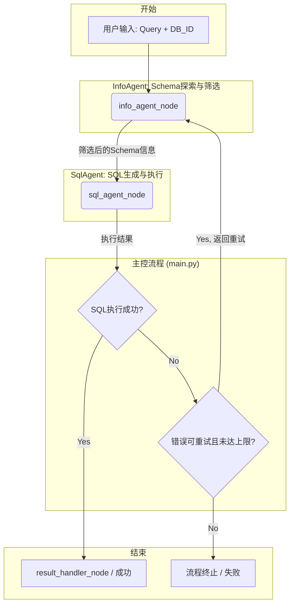

基于 LangGraph 构建的智能 SQL 生成系统，采用函数式编程架构，通过函数式 InfoAgent 和 SQLAgent 的协作，实现自然语言到 SQL 的自动转换，并支持错误自我修正。

## 系统架构

### 核心组件

1. **通信模块 (Communicate.py)** - 状态、消息和输出 Schema 定义

   - SimpleState：图系统状态定义
   - SchemaInfo：Schema 信息结构
   - SQLExecutionResult：SQL 执行结果
   - SystemState：基础系统状态
   - OutputSchema：输出结果格式定义
   - AgentOutputParser：Agent 输出解析器

2. **主程序模块 (main.py)** - 核心功能实现

   - 图系统节点函数（InfoAgent、SqlAgent 等）
   - 工作流程编排
   - 状态管理
   - 命令行接口

3. **InfoAgent 模块 (InfoAgent.py)** - 数据库 Schema 信息探索函数集

   - prepare_schema_info：准备数据库 Schema 信息
   - get_all_tables：获取所有表信息
   - get_table_fields：获取表字段信息
   - filter_useful_tables：过滤有用的表
   - filter_useful_fields：过滤有用的字段

4. **SQLAgent 模块 (SqlAgent.py)** - SQL 生成函数集
   - process_query：处理用户查询
   - generate_sql：SQL 生成
   - execute_sql：SQL 执行
   - extract_sql_from_response：从响应中提取 SQL
   - clean_sql：清理 SQL 语句

### 工作流程



上面的流程图展示了系统处理一个用户查询的完整生命周期。数据在各个核心节点之间流转，并通过条件判断来决定流程的走向，具体步骤如下：

1.  **开始 (用户输入)**

    - **数据**: 用户提供自然语言查询（`Query`）和目标数据库的标识（`DB_ID`）。
    - **动作**: `main.py`中的`run`函数接收这些输入，并初始化`langgraph`的状态图，启动整个流程。流程的第一个节点是`info_agent_node`。

2.  **`info_agent_node` (Schema 探索与筛选)**

    - **输入**: `Query` 和 `DB_ID`。
    - **动作**:
      1.  **查询图数据库**: 首先，该节点通过`InfoAgent.py`中的函数，连接到一个 Neo4j 图数据库，获取与`DB_ID`相关的所有表的元数据。
      2.  **LLM 筛选表**: 然后，它将用户`Query`和所有表信息发送给大型语言模型（LLM），使用`TABLE_USEFULNESS_PROMPT`提示词，让 LLM 判断哪些表与回答用户问题最相关。
      3.  **LLM 筛选字段**: 接着，对于每个被选中的"相关表"，它会获取该表的所有字段，并再次请求 LLM（使用`FIELD_USEFULNESS_PROMPT`），从这些字段中筛选出与用户`Query`最相关的字段。
    - **输出**: 一个高度精炼、只包含相关表和相关字段的`Schema信息`对象。这个对象被传递给下一个节点`sql_agent_node`。这一步极大地减少了后续 SQL 生成的干扰信息。

3.  **`sql_agent_node` (SQL 生成与执行)**

    - **输入**: 用户`Query`, `DB_ID`, 以及上一步骤筛选出的`Schema信息`。
    - **动作**:
      1.  **生成 SQL**: `SqlAgent.py`中的函数接收到这些信息，并使用`SQL_AGENT_PROMPT`提示词，再次请求 LLM。这个提示词会指导 LLM 根据精炼的`Schema信息`生成精确的、符合 Snowflake 数据库规范的 SQL 语句。
      2.  **执行 SQL**: 生成的 SQL 语句会立即在目标 Snowflake 数据库上执行。这个过程被设计为"失败安全"的，即便是 SQL 有误，程序也不会崩溃，而是会捕获错误信息。
    - **输出**: 一个包含执行结果的字典，其中包括一个`success`布尔标志，以及成功时返回的数据或失败时的`error_message`。

4.  **条件判断 (主控流程)**

    - **输入**: `sql_agent_node`的输出结果。
    - **`SQL执行成功?`**: `main.py`检查`success`标志。
      - **Yes**: 如果为`true`，流程直接走向`result_handler_node`，准备成功退出。
      - **No**: 如果为`false`，流程进入下一个判断。
    - **`错误可重试且未达上限?`**: `main.py`中的`_should_retry_error`函数会分析`error_message`。
      - **Yes**: 如果错误是由于找不到表或列等"可重试"错误（意味着`InfoAgent`提供的 Schema 信息有误），并且当前重试次数没有超过上限（默认为 3 次），流程将**返回到`info_agent_node`**，形成一个自我修正的循环，期望在下一次获取到更准确的 Schema 信息。
      - **No**: 如果错误是 SQL 语法错误等"不可重试"错误，或已达到最大重试次数，流程将直接走向失败的终点。

5.  **结束**
    - **`result_handler_node / 成功`**: 当 SQL 成功执行后，该节点被调用，它将最终结果（SQL 语句、查询数据等）格式化，并将流程状态标记为完成，程序成功退出。
    - **`流程终止 / 失败`**: 在不可重试的错误或达到重试上限后，流程终止，并报告最终的错误信息。

## 使用方法

### 基本使用

```python
from method.main import run

# 方式1：直接使用主函数
result = run(
    query="What is the total market value of USDC tokens in 2023?",
    database_id="CRYPTO",
    additional_info="",
    save_to_csv=True
)

# 方式2：使用命令行
# python main.py -q "What is the total market value of USDC tokens in 2023?" -d CRYPTO

# 方式3：分别使用各个函数（最大控制）
from method.InfoAgent import prepare_schema_info
from method.SqlAgent import process_query, generate_sql

schema_info = prepare_schema_info("What is the total market value of USDC tokens in 2023?", "CRYPTO")
result = process_query("What is the total market value of USDC tokens in 2023?", schema_info, "CRYPTO")
```

### 命令行使用

```bash
# 运行预定义测试查询（默认模式）
cd method
python main.py

# 运行自定义查询
python main.py --query "What is the total market value of USDC tokens in 2023?" --database CRYPTO

# 使用简化参数
python main.py -q "SELECT * FROM table" -d CRYPTO

# 添加额外信息
python main.py -q "查询语句" -d CRYPTO --additional-info "额外信息"

# 不保存结果到CSV文件
python main.py -q "查询语句" --no-csv
```

### 命令行参数说明

- `--query, -q`: 用户查询语句（可选，不提供则运行预定义测试）
- `--database, -d`: 数据库 ID（默认：CRYPTO）
- `--additional-info, -a`: 额外信息（可选）
- `--no-csv`: 不保存结果到 CSV 文件

## API 接口

### 状态定义 (Communicate.py)

```python
# 使用 Pydantic 模型定义输出格式
class SQLExecutionResult(BaseModel):
    success: bool
    sql_query: str
    result_data: List[Dict[str, Any]]
    error_message: Optional[str] = None
    execution_time: float

class SchemaInfo(BaseModel):
    useful_tables: Dict[str, Any]
    total_tables_count: int
    filtered_tables_count: int
    database_id: str

class SimpleState(BaseModel):
    user_query: str              # 用户查询
    database_id: str             # 数据库ID
    schema_info: Dict[str, Any]  # Schema信息
    generated_sql: str           # 生成的SQL
    execution_result: Dict[str, Any]  # 执行结果
    step: str                    # 当前步骤
    iteration: int               # 当前迭代次数
    max_iterations: int          # 最大迭代次数
    final_sql: str              # 最终SQL
    final_result: List[Dict[str, Any]]  # 最终结果
    error_message: str          # 错误信息
    is_completed: bool          # 是否完成

# 输出格式定义
class OutputSchema(BaseModel):
    success: bool
    final_sql: str
    final_result: List[Dict[str, Any]]
    iterations: int
    execution_time: float
    csv_file: Optional[str] = None
    error_message: Optional[str] = None
```

### InfoAgent 函数 (InfoAgent.py)

```python
# 核心函数
def prepare_schema_info(user_query: str, database_id: str) -> Dict[str, Any]
def get_all_tables(database_id: str) -> Dict[str, Any]
def get_table_fields(table_name: str, database_id: str) -> Dict[str, Any]
def filter_useful_tables(user_query: str, all_tables: Dict[str, Any]) -> List[str]
def filter_useful_fields(user_query: str, table_name: str, table_info: Dict[str, Any]) -> List[str]

# 便捷接口
def process_info_request_simple(user_query: str, database_id: str) -> Dict[str, Any]
```

### SqlAgent 函数 (SqlAgent.py)

```python
# 核心函数
def process_query(user_query: str, schema_info: Dict[str, Any], database_id: str) -> Dict[str, Any]
def generate_sql(user_query: str, schema_info: Dict[str, Any], database_id: str) -> str
def execute_sql(sql_query: str, database_id: str) -> Dict[str, Any]

# 辅助函数
def extract_sql_from_response(response_text: str) -> str
def clean_sql(sql: str) -> str
def validate_sql_basic(sql: str) -> bool

# 便捷接口
def generate_and_execute_sql(user_query: str, schema_info: Dict[str, Any], database_id: str) -> Dict[str, Any]
def quick_sql_test(sql: str, database_id: str) -> Dict[str, Any]
```

### 返回结果格式

```python
# 系统最终输出格式 (OutputSchema)
{
    "success": true,
    "final_sql": "SELECT ...",
    "final_result": [...],
    "iterations": 3,
    "execution_time": 2.5,
    "csv_file": "sql_result_CRYPTO_20231201_143022.csv",
    "error_message": null
}

# SQL执行结果格式 (SQLExecutionResult)
{
    "success": true,
    "sql_query": "SELECT ...",
    "result_data": [...],
    "error_message": null,
    "execution_time": 1.2
}

# Schema信息格式 (SchemaInfo)
{
    "useful_tables": {
        "SCHEMA.TABLE_NAME": {
            "schema": "SCHEMA",
            "table": "TABLE_NAME",
            "useful_fields": ["field1", "field2"],
            "total_fields_count": 10,
            "filtered_fields_count": 2
        }
    },
    "total_tables_count": 50,
    "filtered_tables_count": 3,
    "database_id": "CRYPTO"
}
```

## 配置选项

### 系统参数

```python
# 在main.py中的配置
MAX_ITERATIONS = 3  # 最大迭代次数

# 运行时配置
config = {
    "configurable": {
        "thread_id": "sql_session"
    }
}
```

### 函数配置

```python
# InfoAgent函数配置
info_config = {
    "similarity_threshold": 0.6,  # 相似度阈值
    "max_suggestions": 10,        # 最大建议数量
    "cache_timeout": 300         # 缓存超时（秒）
}

# SQLAgent函数配置
sql_config = {
    "quality_threshold": 0.7,     # 质量分数阈值
    "max_retries": 3,            # 最大重试次数
    "batch_size": 1000           # 批处理大小
}
```

## 错误处理

系统包含完善的错误处理机制：

### 错误类型

- `NETWORK_ERROR`: 网络连接错误
- `DATABASE_ERROR`: 数据库错误
- `SQL_SYNTAX_ERROR`: SQL 语法错误
- `SCHEMA_ERROR`: Schema 相关错误
- `LLM_ERROR`: LLM 调用错误
- `VALIDATION_ERROR`: 验证错误
- `TIMEOUT_ERROR`: 超时错误

### 重试策略

- 网络错误：指数退避重试
- 数据库错误：短延迟重试
- Schema 错误：立即重试
- 语法错误：不重试（需要重新生成）

### 错误恢复

1. **表不存在** → InfoAgent 查找相似表名
2. **字段不存在** → InfoAgent 查找相似字段
3. **语法错误** → SQLAgent 重新生成
4. **结果为空** → 分析查询条件并调整

## 性能监控

系统内置性能监控功能：

```python
from method.error_handler import global_performance_monitor

# 获取性能报告
report = global_performance_monitor.get_performance_report()
print(report)
```

## 日志配置

系统支持详细的日志记录：

```python
import logging

# 配置日志级别
logging.basicConfig(
    level=logging.INFO,
    format='%(asctime)s - %(name)s - %(levelname)s - %(message)s'
)
```
